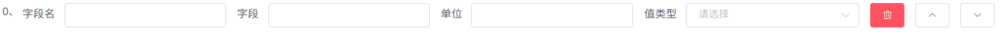

# 1.1. 新建模型
### 进入管理模型菜单，点击***新建模型***按钮
模型名称 为展示的模型名称        
模型分类 配置的是模型属于业务应用、平台资源、基础设施中的哪个分类    
模型字段 为模型在数据库中使用的字段（必须为字母：建议使用驼峰式命名法）    
名称 组成名称的字段,可多选、有序组合、必选    
唯一字段 组成资产唯一性的字段,可多选、有序组合、必选    

### 新增字段
字段名 为展示的字段名称     
字段 即字段（必须为字母：建议使用驼峰式命名法）    
单位 此字段的单位符号    
值类型 字段值类型    
向上箭头 向上调整字段位置    
向下箭头 向下调整字段位置    

### 新增字段组
字段组名 为展示的字段组名称     
字段组 即字段组的字段（必须为字母：建议使用驼峰式命名法）    
统计方式 即统计统计字段的个数、和、平均值    
统计字段 即用作统计的子字段     
向上箭头 向上调整字段位置    
向下箭头 向下调整字段位置    

### 新增子字段
   

