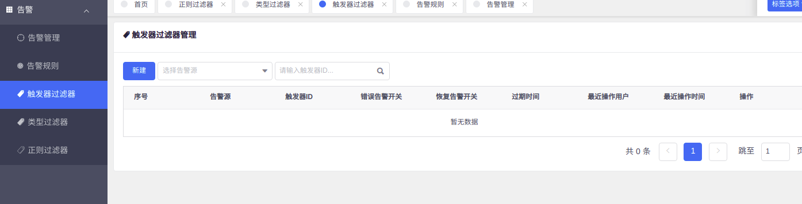
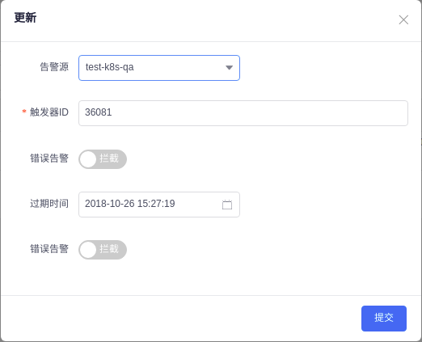
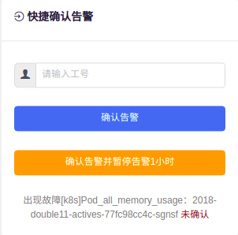
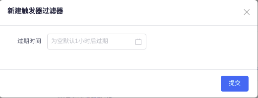

# 1.1. 触发器过滤器
> 触发器过滤器用于指定触发器的定时过滤（**生效有时间范围，自动过期**）。我们可以控制指定告警源下的某个触发器在一定时间范围中，错误告警和恢复告警的过滤策略。
### 触发器过滤器菜单
>> 通常我们可以点击触发器过滤器菜单进入管理界面操作。      

>> 点击新建或者编辑触发器过滤器

### 确认告警生成的触发器过滤器
>> 在确认告警的时候，一般情况我们会使用蓝色按钮的，而黄色的按钮（确认告警并暂停告警1小时）即为创建了一个触发器过滤器，将会过滤当前触发器的告警和恢复告警，生效时间为点击时间后的1个小时。后面如果需要调整，可以直接进入触发器过滤器菜单编辑调整。    

### 告警管理中的触发器过滤器
>> 在告警管理中，可以直接点击某个告警后面的触发器过滤按钮，直接操作进行过滤。    

>> 此界面中我们只需选择过期时间即可快速创建一个触发器过滤器。。后面如果需要调整，可以直接进入触发器过滤器菜单编辑调整。

