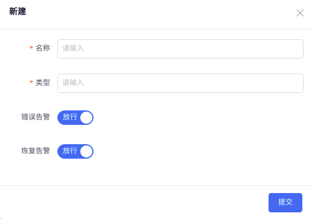

# 1.2. 类型过滤器
> 类型过滤器用于指定类型的错误告警和恢复告警的过滤策略。当前更建议使用正则过滤代替，在这里可以作了解
### 类型过滤器菜单
>> 通常我们可以点击类型过滤器菜单进入管理界面操作。      

>> 点击新建或者编辑类型过滤器

### 告警管理中的类型过滤器
>> 在告警管理中，可以直接点击某个告警后面的类型过滤按钮，直接操作进行过滤。    

>> 此界面中我们只需填写名称即可快速创建一个类型过滤器。。后面如果需要调整，可以直接进入类型过滤器菜单编辑调整。

